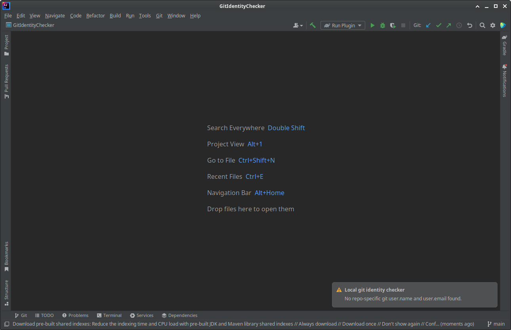

#  Git Identity Checker

This is an IntelliJ plugin to prevent making commits without local `user.name` and `user.email`.

In runs as part of the standard 'commit' button action and shows an error message if this condition is not found.

Motivation is to prevent commits under the wrong mail address when working on multiple repositories (work, private, GitHub, BitBucket,...).

## Features
- Automatic check before each commit, shows yes/no warning dialog if no local name/mail are found.
- Manual check via "Tools" menu and "Check Local Git Config...".
- Check when opening a repository, shows a notification if no local name/mail are found.

## Installation
### Via Marketplace
 This plugin is available via JetBrains Marketplace as [Git Identity Checker](https://plugins.jetbrains.com/plugin/23050-git-identity-checker).

### Via Repository
- Invoke the `buildPlugin` Gradle task to create the plugin distribution
- The resulting ZIP file is located in `build/distributions` and can be installed via "Install Plugin from Disk..." 
- Read more: https://plugins.jetbrains.com/docs/intellij/publishing-plugin.html#building-distribution

## Development
### Requirements
- IntellijIDEA 2023.2.4 or later
- Written in Kotlin, Gradle, ...

### Running and Debugging

- Open the project in Intellij, set breakpoints and click the debug icon. A new IntelliJ Community Edition window will
  open and stop on breakpoints.
- There is also a log available, menu 'Help', 'Show log in files', look for
  lines containing "GitIdentityChecker".

### Where is the code?
- All the commit check logic is in `src/main/kotlin/com/github/CheckinHandlerFactory.kt`
- The plugin components are registered in `src/main/resources/META-INF/plugin.xml`

## Screenshots

## Release Process
- Increase version in [build.gradle.kts](build.gradle.kts)
- edit change-notes in [src/main/resources/META-INF/plugin.xml](src/main/resources/META-INF/plugin.xml)
- Build a zip via `buildPlugin` target, appears in [build/distributions/](build/distributions)
- Upload manually via https://plugins.jetbrains.com/plugin/23050-git-identity-checker
- Create a commit + version tag and push to GitHub
